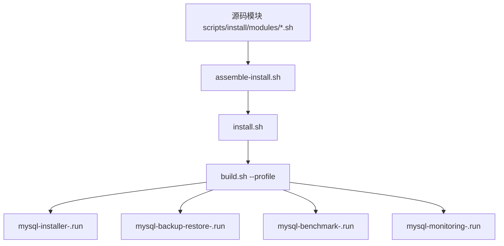
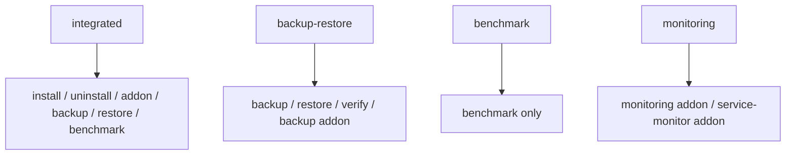

# MySQL 离线交付与运维工具包架构说明

## 1. 设计目标

这套项目当前要同时解决四类问题：

1. MySQL 本体如何在离线环境稳定交付
2. 备份、恢复、恢复校验如何抽象成可复用能力
3. 压测、监控、备份恢复如何拆成独立包，减少非目标场景的使用成本
4. 在保留集成交付能力的同时，避免脚本继续膨胀成不可维护的“集成怪”

---

## 2. 最终产品结构

解释：

1. 源码仍然是一套
2. 通过 `--profile` 裁剪出不同职责的离线包
3. 集成包继续服务完整交付场景
4. 能力包面向已有 MySQL 的专项运维场景

---

## 3. 运行时能力分层

原则：

1. 涉及 StatefulSet 对齐和离线整体交付的，归 `integrated`
2. 可独立附着在已有 MySQL 上的外围能力，尽量做成能力包
3. 用户不应该为了压测或做备份恢复，被迫接受完整安装器

---

## 4. 备份恢复能力抽象

### 4.1 backup plan

当前备份能力不再绑定为“单一后端配置”，而是升级为 `backup plan` 模型。

一个 plan 包含：

1. 计划名 `name`
2. 存储名 `storeName`
3. 后端类型 `backend=nfs|s3`
4. 具体目的地参数
5. 调度 `schedule`
6. 保留策略 `retention`
7. 导出范围 `all | databases | tables`

### 4.2 多中心

由此自然支持：

1. 多个 NFS
2. 多个 MinIO / S3
3. NFS + S3 混合
4. 主计划 + 额外计划
5. 关闭默认主计划，只保留显式定义计划

### 4.3 部分导出

范围支持：

1. 全量导出
2. 指定数据库导出
3. 指定表导出

这使备份恢复能力不再只是“全库 dump”，而是能服务：

1. 审计表归档
2. 重点业务库多中心备份
3. 某些库的异地留存
4. 部分表的恢复回放

---

## 5. 恢复边界

恢复链路新增了两个重要约束：

1. `--restore-source` 可以指定从哪个 plan 恢复；`auto` 则按计划顺序尝试
2. 当来源是“部分库/表备份”时，只允许 `merge`；禁止 `wipe-all-user-databases`

原因很直接：

1. 部分备份并不覆盖全部业务库
2. 如果先清空所有用户库再导入部分 dump，会造成非目标库丢失

另外，`verify-backup-restore` 只会选择覆盖 `offline_validation.backup_restore_check` 的备份来源做闭环校验，避免拿不包含校验数据的 plan 误判失败。

---

## 6. addon 与 install 的边界

### 6.1 install

负责：

1. MySQL 本体
2. StatefulSet / Service / PVC
3. sidecar 型能力
4. 集成包场景下的统一交付体验

### 6.2 addon-install

负责：

1. 监控 exporter
2. ServiceMonitor
3. 备份脚本、存储 Secret、CronJob

原则：

1. 尽量新增外围资源
2. 尽量不修改 MySQL StatefulSet
3. 尽量不触发业务实例滚动更新

---

## 7. 源码结构

当前源码按职责拆分，而不是按函数拆分：

- `00-header.sh`: 变量、默认值、镜像
- `10-core.sh`: 日志、通用函数
- `20-help.sh`: 帮助文案
- `25-package-profile.sh`: 产物包能力边界
- `30-args.sh`: 参数解析与动作门禁
- `35-backup-plans.sh`: 多计划备份抽象
- `40-inputs-and-plan.sh`: 输入校验、执行计划
- `50-render-and-apply.sh`: payload、镜像、模板渲染
- `60-runtime.sh`: 运行时公共逻辑
- `70-lifecycle-actions.sh`: install / uninstall / addon
- `80-data-actions.sh`: backup / restore / verify
- `90-benchmark-and-main.sh`: benchmark 与入口

这样做的好处：

1. review 更聚焦能力边界
2. 维护时更容易定位模块职责
3. 可以在不复制代码的情况下产出多个包
