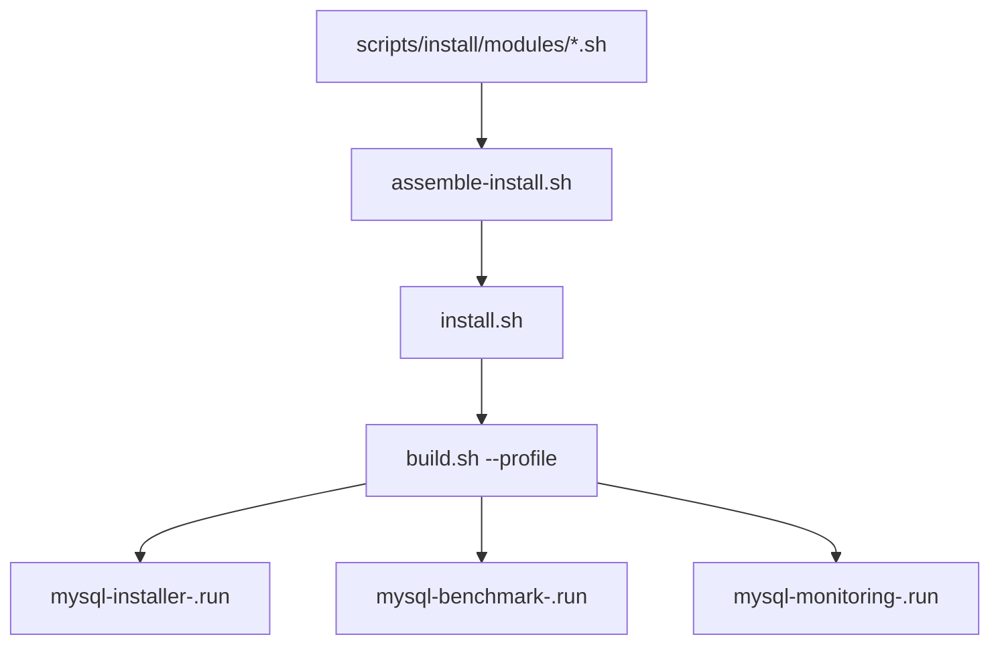
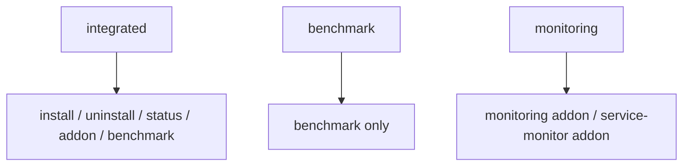

# MySQL 离线交付与运维工具包架构说明

## 1. 设计目标

这一版的目标很明确：
1. `apps_mysql` 只保留安装、监控、压测
2. 备份恢复完全从 MySQL 安装器里剥离
3. 日志默认对 `kubectl logs` 友好
4. 仍保留可选的 slow log sidecar 路径

## 2. 产物结构

解释：
1. 源码仍是一套
2. 通过 `--profile` 裁剪出不同职责的离线包
3. 集成包继续服务完整离线交付场景
4. 能力包面向已有 MySQL 的专项运维场景

## 3. 运行时能力分层

原则：
1. 涉及 StatefulSet 对齐和离线整体交付的，归 `integrated`
2. 可独立附着在已有 MySQL 上的外围能力，尽量做成能力包
3. 用户不应该为了压测或补监控，被迫接受完整安装器

## 4. 日志链路

### 4.1 默认链路

默认情况下：
1. MySQL 配置只写安全文件路径 `/var/log/mysql/*.log`
2. 默认通过软链接把 error.log / slow.log 映射到 `stderr` / `stdout`
3. 因此 `kubectl logs -c mysql` 可直接查看
4. 平台 DaemonSet 也可以直接采集

### 4.2 sidecar 链路

启用 `--enable-fluentbit` 时：
1. 错误日志仍留在 `mysql` 容器 `stderr`
2. slow log 写入真实文件
3. `fluent-bit` sidecar 负责转发 slow log

这样做的好处是：
1. `kubectl logs -c mysql` 仍能用于现场排障
2. 需要文件慢日志时仍有独立 sidecar
3. 日志职责边界清晰，不再把所有日志都塞进 sidecar

## 5. 备份恢复边界

`apps_mysql` 已不再承担：
1. backup / restore / verify
2. backup addon
3. backup plan file
4. NFS / MinIO 多中心备份逻辑

这些内容已经迁移到独立数据保护系统，避免 MySQL 安装器继续膨胀。

## 6. 源码结构

- `00-header.sh`: 变量、默认值、镜像
- `10-core.sh`: 日志与通用函数
- `20-help.sh`: 帮助文档
- `25-package-profile.sh`: 产物包能力边界
- `30-args.sh`: 参数解析与动作门禁
- `40-inputs-and-plan.sh`: 输入校验与执行计划
- `50-render-and-apply.sh`: payload、镜像、模板渲染
- `60-runtime.sh`: 运行时公共逻辑
- `70-lifecycle-actions.sh`: install / uninstall / addon
- `80-data-actions.sh`: benchmark 与老 backup 资源清理
- `90-benchmark-and-main.sh`: benchmark 入口与主流程
