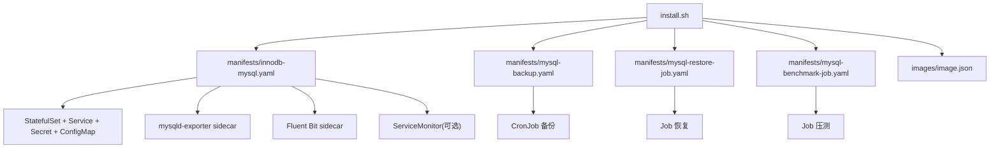

# MySQL 离线安装器架构解析

## 1. 目标

本项目的目标不是做一个“只能首次安装”的一次性脚本，而是做一个可以反复执行、可按需开关能力、适合离线环境交付的 MySQL 安装包。它需要解决四类问题：

1. MySQL 本体部署和基础访问。
2. 备份、恢复、恢复校验。
3. 监控、日志采集、压测等运维辅助能力。
4. 在不同集群能力不完整的情况下，仍然可以稳定安装。

## 2. 总体结构



## 3. 安装器工作方式

`install.sh` 的核心定位是“声明式对齐器”。

这意味着：

1. 第一次执行时，它会创建资源。
2. 第二次执行时，它会按当前命令行参数更新已有资源。
3. 当某个可选能力被关闭时，它不仅不再创建，还会清理旧的残留资源。

这样做的好处是后期运维简单。比如一开始没装 `ServiceMonitor`，等集群补了 `Prometheus Operator` 后，只要再次执行 `install`，就能补齐监控声明。

## 4. 为什么 exporter 采用 sidecar

`mysqld-exporter` 与 MySQL 实例关系紧密，sidecar 方式有几个明显优势：

1. 生命周期天然绑定，不需要再额外维护一个独立 Deployment。
2. 就近采集，配置简单。
3. 即便没有 `ServiceMonitor`，指标端口依然可被手工采集。

因此当前版本把 exporter 作为实例级能力内嵌，而不是拆成集群级组件。

## 5. 为什么 ServiceMonitor 不强制安装整套监控体系

`ServiceMonitor` 只是 Prometheus Operator 的 CRD 资源，不是完整监控平台本身。

如果集群没有对应 CRD，强行创建只会安装失败。因此当前策略是：

1. exporter sidecar 仍然默认安装。
2. 只有发现 `servicemonitors.monitoring.coreos.com` CRD 时才创建 `ServiceMonitor`。
3. 本项目不代装 Prometheus Operator。

这个边界是刻意设计的。MySQL 安装包应尽量避免去安装集群级公共能力，以减少副作用。

## 6. 为什么 Fluent Bit 采用 sidecar

MySQL 的 `error log` 和 `slow query log` 在容器内部文件路径下生成。若使用 sidecar：

1. 能直接共享卷读取日志文件。
2. 不依赖宿主机日志路径。
3. 对单实例问题定位更直接。

当前版本不尝试安装集群级 DaemonSet 日志方案，因为那会引入更大的平台边界和更多前置依赖。后续若需要统一日志平台，建议单独做一个日志栈安装包。

## 7. 备份后端设计

### 7.1 NFS

NFS 适合离线环境和内网环境。使用时需要两个信息：

1. `--backup-nfs-server`
2. `--backup-nfs-path`

安装器会在导出路径下自动创建业务子目录：

```text
<backup-nfs-path>/<backup-root-dir>/mysql/<namespace>/<sts-name>/
```

所以你不需要手工再去拼 `mysql/aict/mysql` 这一层，只需要提供“导出根路径”即可。

### 7.2 S3

S3 模式支持 MinIO、Ceph RGW、AWS S3 等兼容对象存储。

关键设计点：

1. 备份前先从远端同步已有快照到本地暂存目录。
2. 在本地执行保留策略。
3. 再把结果同步回对象存储。

这样可以让 S3 与 NFS 共用同一套快照命名和保留逻辑。

对象路径规则：

```text
<bucket>/<s3-prefix>/<backup-root-dir>/mysql/<namespace>/<sts-name>/
```

## 8. 数据复用与重装

默认情况下，`uninstall` 不会删除 PVC。这意味着在以下条件同时满足时，重装可以直接复用数据卷：

1. `namespace` 不变。
2. `--sts-name` 不变。
3. 没有执行 `uninstall --delete-pvc`。
4. 原 PVC / PV 没有被底层存储回收。

不复用的典型场景：

1. 改了 namespace。
2. 改了 `--sts-name`。
3. 删除了 PVC。
4. 存储类回收策略导致 PV 被释放。

## 9. 缺少外部能力时的处理策略

### 9.1 没有 ServiceMonitor CRD

安装继续，只跳过 `ServiceMonitor`。

### 9.2 没有集中日志平台

Fluent Bit sidecar 仍然可以运行；如果环境暂时不需要，直接 `--disable-fluentbit`。

### 9.3 没有 Prometheus

exporter sidecar 依然可暴露 `/metrics`，后期平台补齐后可再次执行 `install` 进行对齐。

## 10. 推荐的后续演进

当前版本建议保持“应用内嵌 + 集群外部能力分离”的方向：

1. MySQL 安装器只负责实例级能力和必要声明。
2. Prometheus Operator、日志平台、集中告警等应作为独立安装包维护。
3. 二者通过 `install` 的重复执行完成对齐，而不是耦合到一次安装里。
