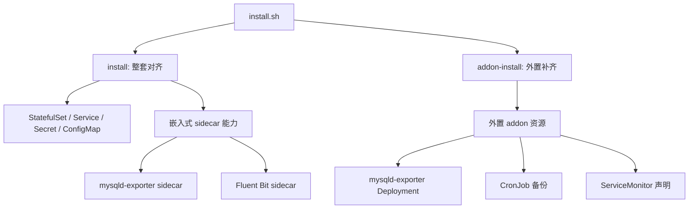
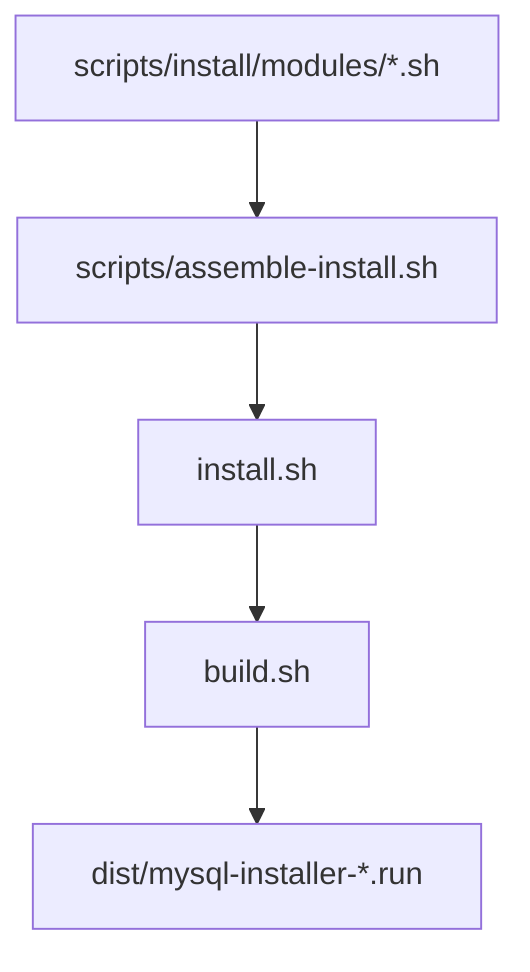

# MySQL 离线安装器架构说明

## 1. 设计目标

这套安装器解决的不是“怎么把 MySQL 首次装起来”，而是长期运维里的几类问题：

1. MySQL 本体如何在离线环境稳定交付
2. 备份、恢复、恢复校验如何标准化
3. 已有 MySQL 如何后补监控、备份等能力
4. 在集群外部能力不完整时，如何做到“能装、能跳过、边界清晰”
5. installer 源码如何保持可维护，而不是继续膨胀成一个难维护的超长 shell

---

## 2. 两层结构

### 2.1 运行时能力结构



### 2.2 源码与产物结构



这里的分工很明确：

1. `scripts/install/modules/*.sh` 是维护入口
2. `scripts/assemble-install.sh` 负责按模块顺序组装
3. 根目录 `install.sh` 是最终脚本产物
4. `build.sh` 再把 `install.sh` 和 payload 拼成最终 `.run`

因此根目录 `install.sh` 仍然有用，但它的主要价值是：

1. 产物入口
2. 调试入口
3. 语法检查入口

而不是主要源码入口。

---

## 3. 为什么不用“每个函数一个文件”

之前的函数级拆分，理论上看起来很细，但工程上不友好：

1. 一个需求经常跨很多函数文件
2. review 难以聚焦到“一个能力改动”
3. 文件数量过多后，目录反而更难读
4. 新人维护时很难建立整体心智模型

现在改成“职责模块拆分”：

- `00-header.sh`
- `10-core.sh`
- `20-help.sh`
- `30-args.sh`
- `40-inputs-and-plan.sh`
- `50-render-and-apply.sh`
- `60-runtime.sh`
- `70-lifecycle-actions.sh`
- `80-data-actions.sh`
- `90-benchmark-and-main.sh`

这种方式更适合：

1. 按功能 review
2. 按能力维护
3. 控制模块数量
4. 避免目录碎片化

---

## 4. install 与 addon-install 的职责边界

### 4.1 install

`install` 的定位是“整套声明式对齐器”。

适用场景：

1. 首次安装
2. 已有实例需要整体变更配置
3. 可以接受 MySQL 相关资源被重新对齐
4. 需要调整 StatefulSet 级别能力

### 4.2 addon-install

`addon-install` 的定位是“外置能力补齐器”。

适用场景：

1. MySQL 已经在跑
2. 只想补监控或备份能力
3. 不希望因为补能力而重建 MySQL Pod

这也是为什么当前 addon 默认只承载“外围资源型能力”，而不是一切能力都塞进去。

---

## 5. 为什么要区分嵌入式能力和外置 addon

用户真正关心的不是组件名字，而是业务影响。

在 Kubernetes 里：

1. 改 StatefulSet Pod 模板，通常就意味着滚动更新
2. 新增 Deployment / CronJob / Service 等外围资源，通常不会动现有 MySQL Pod

所以本项目把“是否影响数据库工作负载”作为第一分类标准。

这就是：

1. `install` 负责本体与嵌入式能力
2. `addon-install` 负责外置能力

---

## 6. 监控设计

### 6.1 嵌入式监控

在 `install` 路径中，`mysqld-exporter` 仍可作为 sidecar 启用。

优点：

1. 与数据库实例生命周期绑定
2. 对逐实例观测最直接
3. 多副本场景下更自然

代价：

1. 需要改 StatefulSet 模板
2. 可能触发滚动更新

### 6.2 外置监控 addon

在 `addon-install` 路径中，监控采用外置 `mysqld-exporter Deployment`。

优点：

1. 适合给已有实例后补监控
2. 不必重建 MySQL Pod
3. 业务影响更可控

代价：

1. 默认更偏向单实例或主节点优先观测
2. 如果需要逐副本精细采集，sidecar 仍更强

---

## 7. ServiceMonitor 的边界

`ServiceMonitor` 只是 Prometheus Operator 的 CRD 声明，不是完整监控平台。

当前策略：

1. 如果 CRD 存在，则创建 `ServiceMonitor`
2. 如果 CRD 不存在，则 warning 并跳过
3. 不因为缺少 CRD 让整个动作失败

这个决策是故意的，因为本项目不负责代装整套监控平台。

---

## 8. 日志设计

### 8.1 推荐路径：平台级日志体系

如果集群已经规划了 DaemonSet 级 Fluent Bit + ES / OpenSearch / Loki，推荐把日志采集放到平台层。

原因：

1. 职责边界更清晰
2. 多应用统一治理更容易
3. 不需要为了日志修改数据库工作负载

### 8.2 兼容路径：MySQL sidecar

如果你的目标是：

1. 必须读取容器内 slow log / error log 文件
2. 平台侧拿不到这些文件
3. 可以接受滚动更新窗口

则仍可使用 `install --enable-fluentbit`。

这是一条兼容能力，不是默认推荐路径。

---

## 9. 备份与恢复设计

### 9.1 NFS

NFS 模式适合离线和内网环境。

最少需要提供：

1. `--backup-nfs-server`
2. `--backup-nfs-path`

目录规则：

```text
<backup-nfs-path>/<backup-root-dir>/mysql/<namespace>/<mysql-target-name>/
```

### 9.2 S3

S3 模式支持兼容对象存储。

目录规则：

```text
<bucket>/<s3-prefix>/<backup-root-dir>/mysql/<namespace>/<mysql-target-name>/
```

### 9.3 latest 快照策略

`restore --restore-snapshot latest` 的处理逻辑是：

1. 优先读取 `latest.txt`
2. 如果 `latest.txt` 指向的快照已不存在
3. 自动回退到当前目录里最新的 `.sql.gz`

这样恢复流程对快照清理更稳健。

### 9.4 认证边界

对下面几个动作：

1. `backup`
2. `restore`
3. `verify-backup-restore`
4. `addon-install --addons backup`

现在都要求显式提供可用的 MySQL 认证信息。

设计原因：

1. 避免在目标 Secret 不存在时误回退到 `--root-password`
2. 避免把安装期密码和运行期连接密码混为一谈
3. 让外部 MySQL 场景下的行为更明确

---

## 10. benchmark 设计

当前 benchmark 的关键点：

1. 使用官方 `openeuler/sysbench` 镜像
2. 不再通过仓库内 Dockerfile 自建 sysbench 镜像
3. 输出 `.log` / `.txt` / `.json`
4. `warmup rows` 与正式 `table size` 已解耦
5. 对 MySQL 8 自动附加更宽松兼容参数

这么做的原因是：

1. 构建链路更短
2. 复现性更高
3. benchmark 更适合被当成运行时工具，而不是仓库内自定义镜像

---

## 11. 数据复用与重装

默认 `uninstall` 不删除 PVC。

因此在这些条件满足时，重装通常可以复用原数据：

1. `namespace` 不变
2. `--sts-name` 不变
3. 没有执行 `uninstall --delete-pvc`
4. 底层 PV 没有被回收

---

## 12. 推荐实践

1. 首次安装时，用 `install` 决定数据库本体与是否接受 sidecar
2. 已有实例后补能力时，用 `addon-install`
3. 监控优先用外置 addon
4. 日志优先用平台级 DaemonSet
5. 只有在必须采集容器内文件日志时，才回到 sidecar
6. 修改 installer 源码时，优先改 `scripts/install/modules/*.sh`
