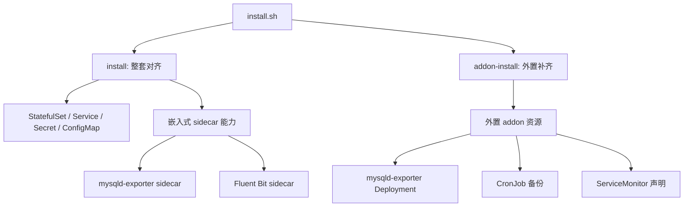

# MySQL 离线安装器架构解析

## 1. 设计目标

这套安装器解决的不是“怎么把 MySQL 首次装起来”，而是下面四类长期运维问题：

1. MySQL 本体如何在离线环境稳定交付。
2. 备份、恢复、恢复校验如何标准化。
3. 已有 MySQL 如何后补监控、备份等运维能力。
4. 在集群外部能力不完整时，如何做到“能装、能跳过、边界清晰”。

## 2. 两层能力模型

当前版本把能力拆成两层：



### 2.1 install

`install` 的定位是“整套声明式对齐器”。

适用场景：

1. 首次安装。
2. 已有实例需要整体变更配置。
3. 可以接受 MySQL Pod 滚动更新。
4. 需要启用 sidecar 型能力。

### 2.2 addon-install

`addon-install` 的定位是“外置能力补齐器”。

适用场景：

1. MySQL 已经在跑。
2. 只想补监控或备份能力。
3. 不希望因为补能力而滚动重建 MySQL Pod。

## 3. 为什么要区分“嵌入式能力”和“外置 addon”

用户真正关心的不是组件名字，而是业务影响。

在 Kubernetes 里：

1. 改 StatefulSet Pod 模板，通常就意味着滚动更新。
2. 额外创建 Deployment / CronJob / Service / CRD 资源，则通常不会动到现有 MySQL Pod。

所以我们把“是否影响数据库工作负载”作为第一分类标准，而不是把所有能力都放进一次安装里。

## 4. 监控设计决策

### 4.1 嵌入式监控

在 `install` 路径里，`mysqld-exporter` 仍支持 sidecar 模式。

优点：

1. 与数据库实例生命周期绑定。
2. 对单 Pod 指标语义最直接。
3. 对多副本情况下的逐实例观测更自然。

代价：

1. 需要改 StatefulSet 模板。
2. 可能触发滚动更新。

### 4.2 外置监控 addon

在 `addon-install` 路径里，监控采用外置 `mysqld-exporter Deployment`。

优点：

1. 新增 Pod 即可完成补齐。
2. 不重建 MySQL Pod。
3. 对“已有实例后补监控”场景非常友好。

代价：

1. 当前默认监控目标是 `mysql-0.mysql.<ns>.svc.cluster.local:3306`。
2. 更适合单实例或主节点优先观测场景。
3. 若你要逐副本精细采集，嵌入式 sidecar 仍然更强。

## 5. ServiceMonitor 的边界

`ServiceMonitor` 只是 Prometheus Operator 的 CRD 声明，不是完整监控平台。

因此本项目刻意不做两件事：

1. 不代装 Prometheus Operator。
2. 不把缺少 CRD 视为安装失败。

当前策略是：

1. 如果 CRD 存在，则创建 `ServiceMonitor`。
2. 如果 CRD 不存在，则给出 warning 并跳过。
3. 监控 addon 自身仍可成立，只是少了声明资源。

## 6. 日志设计决策

### 6.1 推荐路径：平台级日志体系

如果你已经规划 DaemonSet 级 Fluent Bit + ES / OpenSearch / Loki，那么推荐把日志采集放到平台层。

原因：

1. 平台职责边界清晰。
2. 多应用统一治理更容易。
3. 不需要为了日志去修改数据库工作负载。

### 6.2 兼容路径：MySQL sidecar

如果你的目标是：

1. 直接读取容器内 `slow log` 文件。
2. 平台侧拿不到这些文件。
3. 接受滚动更新窗口。

那么仍然可以使用 `install --enable-fluentbit` 走嵌入式 sidecar 路径。

这是一条兼容能力，不再是“已有 MySQL 后补能力”的推荐默认值。

## 7. 备份后端设计

### 7.1 NFS

NFS 模式适合内网和离线环境。

用户至少需要提供：

1. `--backup-nfs-server`
2. `--backup-nfs-path`

安装器会自动在导出路径下建立业务子目录：

```text
<backup-nfs-path>/<backup-root-dir>/mysql/<namespace>/<sts-name>/
```

### 7.2 S3

S3 模式支持兼容对象存储。

路径规则：

```text
<bucket>/<s3-prefix>/<backup-root-dir>/mysql/<namespace>/<sts-name>/
```

实现思路是：

1. 先把对象存储中的已有快照同步到本地暂存目录。
2. 在本地执行统一的快照命名和保留逻辑。
3. 再把结果同步回对象存储。

这样 NFS 和 S3 能共用同一套快照语义。

## 8. 数据复用与重装

默认 `uninstall` 不删除 PVC，因此在以下条件满足时，重装可直接复用原数据：

1. `namespace` 不变。
2. `--sts-name` 不变。
3. 没有执行 `uninstall --delete-pvc`。
4. 底层 PV 没有被回收。

## 9. 当前推荐实践

1. 首次安装时，用 `install` 决定数据库本体和是否接受 sidecar。
2. 已有实例后补能力时，用 `addon-install`。
3. 监控优先用外置 addon。
4. 日志优先用平台级 DaemonSet。
5. 只有在必须采集容器内文件日志时，才回到 sidecar。
